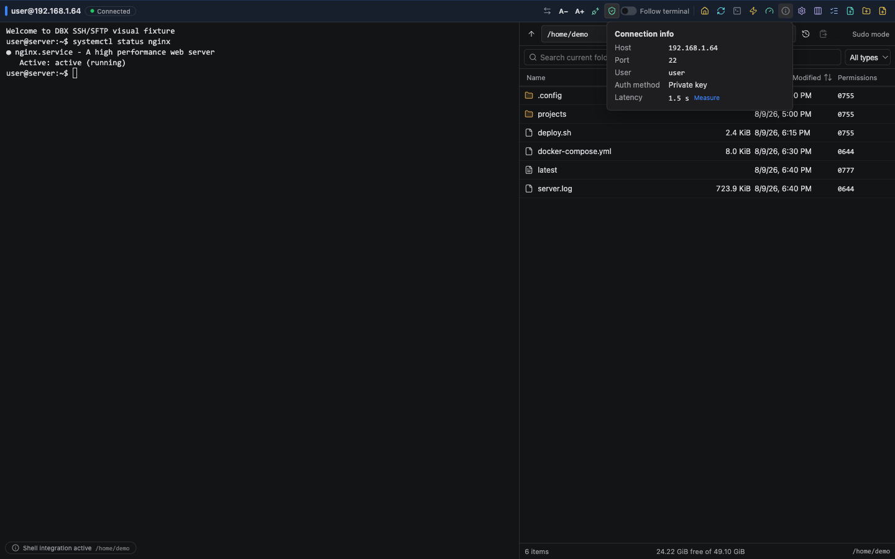
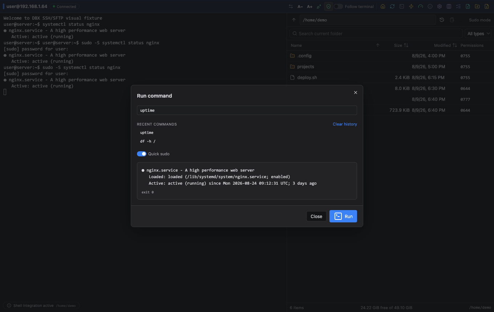

# DBX SSH & SFTP

[](https://github.com/jinpy666/dbx-plugin-ssh/actions/workflows/ci.yml)
[](https://github.com/jinpy666/dbx-plugin-ssh/releases)

[English](README.en.md) · [产品宣传页](docs/MEDIA.zh-CN.md) · [特性与竞品对比](docs/COMPARISON.zh-CN.md) · [独立仓库迁移说明](docs/REPOSITORY_SPLIT.zh-CN.md)

DBX SSH & SFTP 是面向日常服务器运维的连接工作台。它把交互式终端、远程命令、
SFTP 文件管理和安全认证集中在一个界面中，并支持通过宿主连接与传输能力访问
远程环境。


> 终端、SFTP、MCP 自动化和受控运维操作集中在一个 DBX 工作台中。

## 产品演示

[观看 15 秒功能预览](docs/media/dbx-ssh-demo.mp4)




## 适合场景

- 日常 Linux/Unix 服务器巡检、日志查看和远程命令执行。
- 通过跳板机访问内网环境，并在终端与 SFTP 之间快速切换。
- 在受控权限下完成配置文件、脚本和构建产物的上传下载。

## 核心能力

- 支持密码、私钥、SSH Agent、键盘交互和无密码认证。
- 交互式终端支持 PTY、窗口调整、会话恢复、剪贴板、远程目录跟随和批量输入。
- SFTP 支持浏览、排序、预览、上传、下载、重命名、新建、拖放和递归删除。
- 大文件传输支持进度、取消、断点确认和原子替换，降低中断造成的半成品风险。
- 支持 Known Hosts 校验、变更主机密钥拒绝、只读模式和远程目录磁盘用量查看。
- 支持最多三跳 ProxyJump、连接保活、可取消远程命令、chmod 和 Quick Sudo。
- 支持 TOTP/键盘交互式双因素认证，以及面向自动化客户端的 MCP 工具接口。
- 界面支持简体中文、繁体中文、英语、西班牙语、意大利语、日语和葡萄牙语。

完整的能力矩阵和与 OpenSSH、Tabby、Termius、FinalShell 等方案的定位对比见
[特性与竞品对比](docs/COMPARISON.zh-CN.md)。


## MCP 自动化

推荐通过 DBX MCP 桥调用，以复用已保存连接、审批和 sudo 白名单。独立模式可运行：

```bash
DBX_SSH_MCP_READ_ONLY=1 backend/target/release/dbx-plugin-ssh --mcp
```

常用工具包括 `ssh_exec`、`ssh_metrics`、`sftp_list`、`sftp_upload` 和
`sftp_download`。完整配置、工具调用和安全边界见
[MCP 使用指南](docs/MCP_USAGE.zh-CN.md)与[SSH MCP 参考](docs/MCP.zh-CN.md)。

## 安全设计

密码、私钥口令、TOTP 和 sudo 凭据由 DBX 宿主 secret binding 管理。插件不会把
凭据写入配置文件、日志或导出内容。建议生产连接启用 Known Hosts 严格校验，
并按需启用只读模式和 sudo 命令白名单。

## 安装

从 [GitHub Releases](https://github.com/jinpy666/dbx-plugin-ssh/releases) 下载匹配平台的
`.dbxp` 包，在 DBX 插件中心选择本地安装。开发者也可以按照
[迁移与发布说明](docs/REPOSITORY_SPLIT.zh-CN.md) 构建候选包。

## 开发与验证

```bash
pnpm --dir frontend install
pnpm --dir frontend typecheck && pnpm --dir frontend test && pnpm --dir frontend build
cargo test --manifest-path backend/Cargo.toml
python3 scripts/validate_repo.py && node scripts/connection-forms/verify.mjs
scripts/test.sh --skip-host
```

协议、构建和完整集成验证说明位于 `docs/`；公开贡献请先阅读
独立仓库的迁移边界、公共依赖和发布前置条件见
[迁移说明](docs/REPOSITORY_SPLIT.zh-CN.md)。
