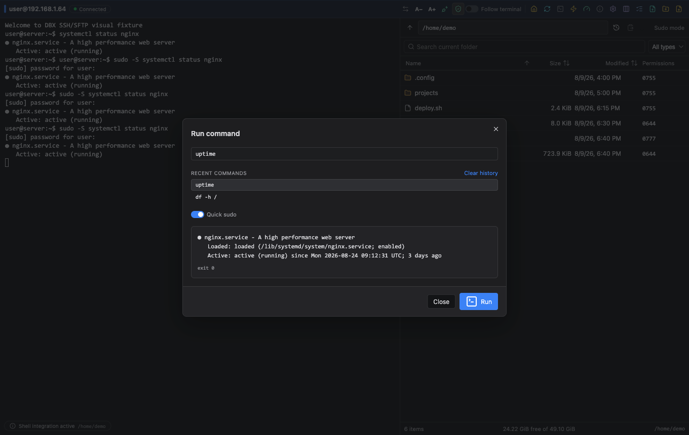
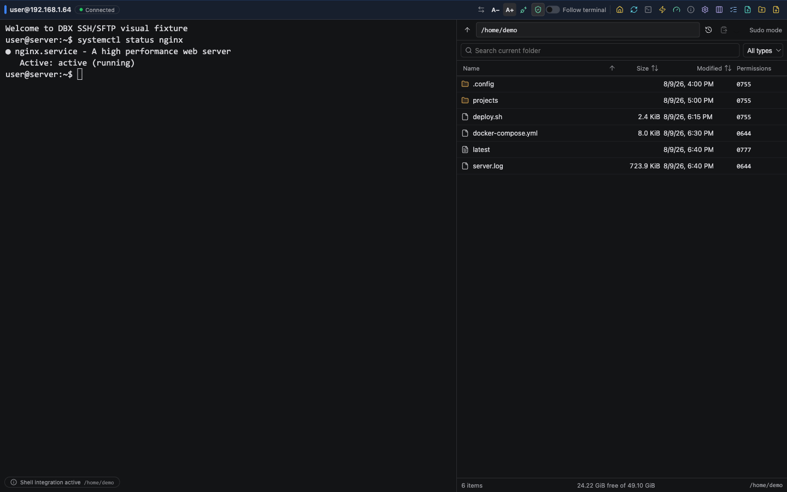

# DBX SSH & SFTP 产品宣传素材

本页集中放置可直接用于 GitHub、发布说明和产品介绍的素材。视频是由仓库内的真实
SSH UI 截图生成的 15 秒无声预览，不代表实时连接性能或远端服务可用性。

## 视频预览

[下载或播放 DBX SSH & SFTP 15 秒功能预览](media/dbx-ssh-demo.mp4)

## 图片画廊

### 工作台与连接

### 终端效率

### 个性化

## 宣传文案

短版：`DBX SSH & SFTP：把终端、SFTP、MCP 自动化和受控运维集中到一个工作台。`

长版：`面向日常服务器运维的 DBX 插件，支持密码、私钥、SSH Agent、跳板链、PTY
终端、SFTP 文件操作、Known Hosts、只读策略、Quick Sudo、TOTP 和 MCP 自动化，
并提供七语界面。`

## 使用边界

素材展示的是插件 UI 和离线能力。真实 SSH 主机、DBX.app 宿主桥、Docker 测试容器和
平台安装流程需要对应运行环境；请以 CI、smoke 和发布说明中的实际验证结果为准。
